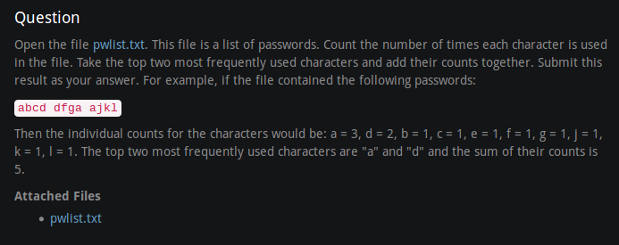
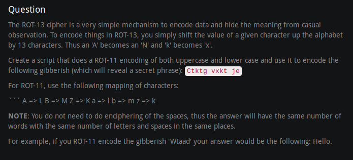
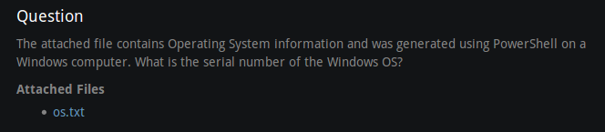
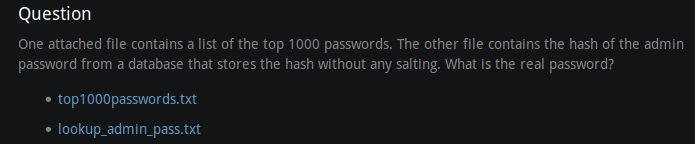
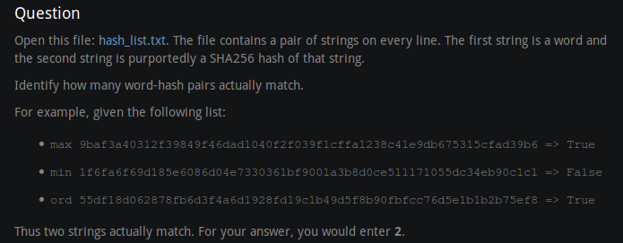

# PyNight-Oct-2017
Participated in PyNight on Oct 13, 2017. It was my first time using and learning Python that night. These are some of the problems I completed that night, but revised and cleaned up, not the original.

## Passwords!

### Flag: 2299814

## ROT-13

### Flag: Never give up

## PowerShell OS Info

### Flag: 00331-60000-00000-AA658

## Lookup Table

### Flag: peekaboo

## Corned Python Hash

### Flag: 982
